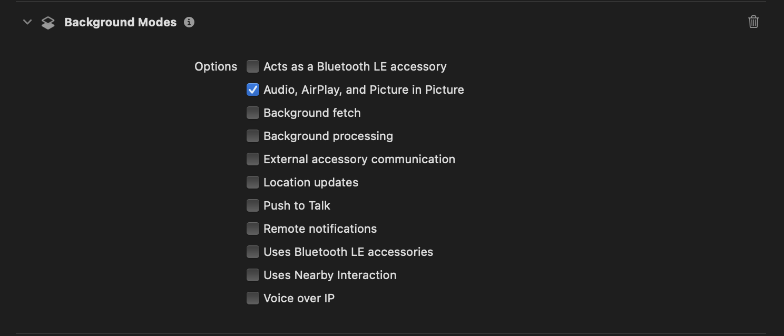

## Simple Metronome App

This is a personal toy project. I've used various metronome apps from the App Store, and while they work well, each has its own drawbacks. For example, some have ads, some can't play the tick sound when running in the background, and others won’t allow sound to play while another music app is active.

I want to create a metronome app that is simple, ad-free, can play the tick sound in the background, and allows me to listen to music or podcasts simultaneously. At the same time, I want to learn how to work with the audio API in iOS. This is the motivation behind the project. It works really well for me, and I hope it can benefit others, too.

## Screenshots

| Start                                                                               | Stop                                                                              |
| ----------------------------------------------------------------------------------- | --------------------------------------------------------------------------------- |
|  |  |

## Features

-   [x] Play tick sound in the background
        go to project settings -> Signing & Capabilities -> Background Modes -> check Audio, AirPlay, and Picture in Picture
        
-   [x] Play tick sound while other music app is playing
        Add the Mix With Others Option: The `.mixWithOthers` option allows your app's audio to play alongside audio from other apps.

In `MetronomeApp.swift`,

```swift
import AVFoundation

do {
    // Set the audio session category to playback with the mixWithOthers option
    try AVAudioSession.sharedInstance().setCategory(.playback, options: .mixWithOthers)
    // Activate the audio session
    try AVAudioSession.sharedInstance().setActive(true)
} catch {
    print("Failed to set audio session category: \(error.localizedDescription)")
}
```

The UI and the elapsed timer are defined in `ContenView.swift`.

The metronome logic is in `Metronome.swift`. The sound is played using `AVAudioPlayer`.

## Future Work

Although the current version meets my needs, I have some ideas for future improvements.

I’ve noticed that, at times, the tick sound is not always accurate—it occasionally lags or rushes. I suspect this happens because other running apps are causing the CPU to become busy, which affects the timing accuracy. After some research, I’ve found that this issue is not easy to resolve. I wonder if this is why the apps from the App Store have those limitations.

I’m eager to learn techniques to solve this problem and would appreciate any feedback or suggestions.
